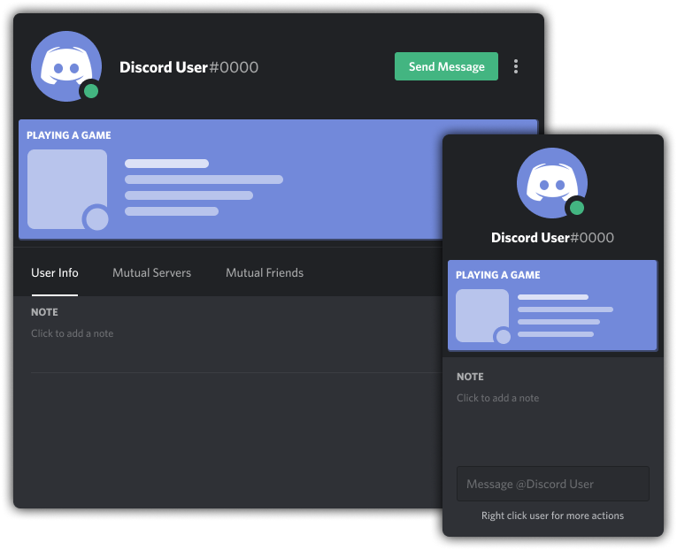

# NO LONGER MAINTAINED
Due to a recent Discord update on user popouts (yes, i know i'm late), and the fact that I'm too burned out to really do anything with this, this thing go boof.

I suggest using https://github.com/mr-miner1/cooler-activity-status instead since it actually works and probably gets updates. goodbye.


# Amazing Activity Cards
Makes Discord's normal activity cards look a bit nicer. 
- This addon was inspred from [NYRI4's](https://github.com/NYRI4) [Comfy Theme](https://github.com/NYRI4/Comfy)!



# Installation
For **[Powercord](http://powercord.dev/)** or **[Vizality](https://vizality.com/)** installation, go to **Themes -> Open a CMD / Powershell / Terminal / Gitbash** in the folder, and enter the following:
```
git clone https://github.com/Discord-Theme-Addons/amazing-activity-cards
```

**For [BetterDiscord](https://betterdiscord.net/):**
- [Direct Dowload](https://betterdiscord.net/ghdl?id=3496)
- [View Source](https://raw.githack.com/Discord-Theme-Addons/amazing-activity-cards/master/src/support/AmazingActivityCards.theme.css)

**For Browser / Web:**
1. Install the Stylus extension for [Chrome](https://chrome.google.com/webstore/detail/stylus/clngdbkpkpeebahjckkjfobafhncgmne) / [Firefox](https://addons.mozilla.org/en-US/firefox/addon/styl-us/) / [Opera](https://github.com/openstyles/stylus/wiki/Opera,-Outdated-Stylus).
2. After installing, head over to [this link](https://raw.githack.com/Discord-Theme-Addons/amazing-activity-cards/master/src/support/AmazingActivityCards.user.css).
3. Press the "Install Style" button.

# Customization
If you dont like how the cards are currently done (i.e. rounding, coloring, backdrop), you can change all of this. All variables to customize these things are located in the `:root{}`.
- If you're on Powercord or Vizality, head over to the `./index.scss` file.
- For those on BetterDiscord or Web, just open the file that you downloaded / the style that you installed.
